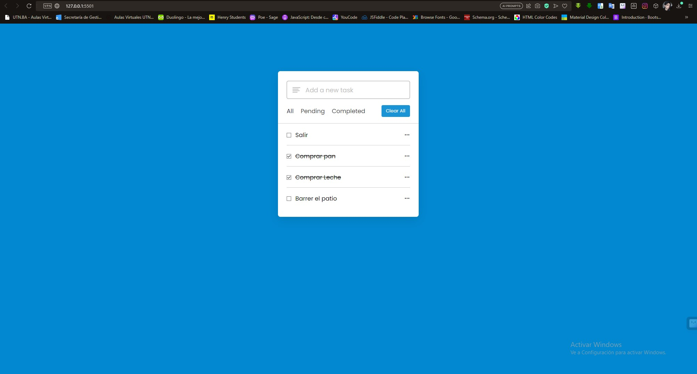

### ToDo App
La aplicación "To-Do" es una herramienta digital diseñada para ayudarte a organizar y administrar tus tareas diarias de manera eficiente. Con esta aplicación, puedes crear listas de tareas, establecer recordatorios y asignar prioridades.

# Screenshot
Here we have project screenshot :

